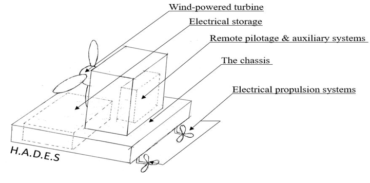
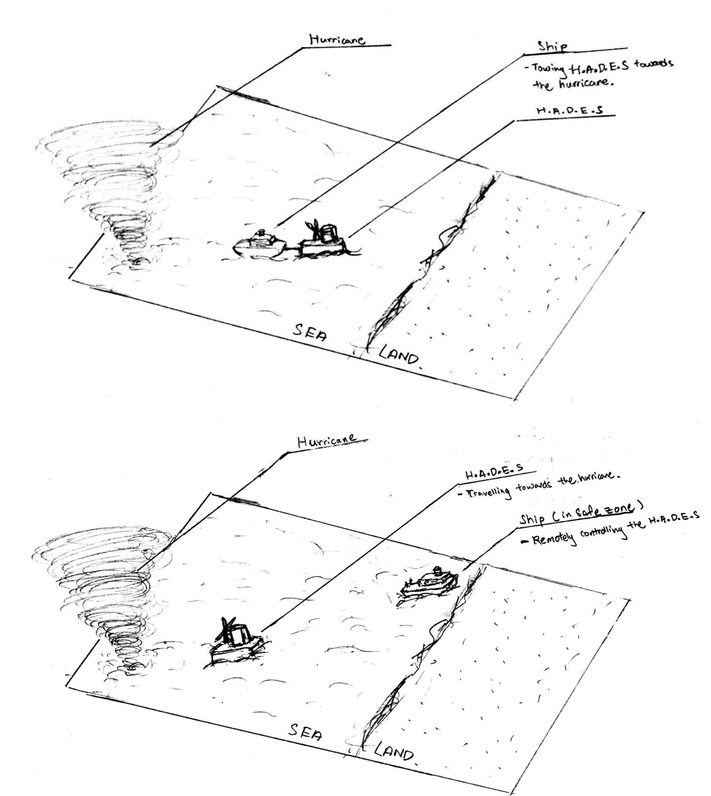

# H.A.D.E.S-hurricane-disruption-system
Autonomous marine fleet concept designed to disrupt hurricane systems and harvest kinetic wind energy.
# H.A.D.E.S: HurricAne Disruption by Electrical-conversion System

## 🌊 Overview
H.A.D.E.S is a macro-engineering conceptual framework designed to disrupt the feedback loops of fully developed hurricane systems. By deploying an autonomous, mobile fleet of semi-submersible wind-harvesting barges directly into a storm's trajectory, the system extracts destructive surface kinetic energy, downgrading the storm's severity before it makes landfall.

📄 **[View Full Proposal PDF](./documentation/Hurricane%20Killer.pdf)**

---

## 🛠️ System Architecture
The mobile platform is split into 5 core integrated subsystems:
* **The Chassis:** A highly buoyant, semi-submersible barge hull designed to withstand extreme wave dynamics.
* **Electrical Propulsion System:** Automated thrusters allowing the unit to maintain dynamic positioning or navigate into the storm path.
* **Wind-Powered Turbine:** Low-center-of-gravity rotors engineered to convert extreme atmospheric forces into electrical energy.
* **Electrical Storage:** High-capacity battery buffering (with provisions for modern green hydrogen conversion).
* **Remote Pilotage & Auxiliary Systems:** Unmanned automated controls steered from a designated maritime safe zone.

*Figure 1: Conceptual rendering of the H.A.D.E.S unmanned barge configuration.*

---

## 🧭 Deployment Methodology
Instead of relying on stationary coastal defense barriers, H.A.D.E.S utilizes a proactive interception framework:
1. **Transit Phase:** Unmanned platforms are towed or propelled to a strategic staging area outside the hurricane's radius.
2. **Interception Phase:** Operators or pathfinding algorithms guide the fleet directly into the storm bands.
3. **Disruption Phase:** The turbine arrays absorb the wind's kinetic energy, decreasing wave heights, reducing ocean evaporation, and effectively starving the hurricane core of its thermal fuel.

*Figure 2: Remote pilotage and fleet deployment framework.*

---

## 🤝 Project Origin & Future Scale
This project was originally conceptualized during my university studies in 2019. While initial prototyping metrics were highly conservative, the modern evolution of **Floating Offshore Wind (FOW)** and **automated marine vessels** aligns perfectly with the core thesis of H.A.D.E.S. 

*For inquiries or collaboration regarding this clean-tech architecture, feel free to connect via my resume or profile.*
